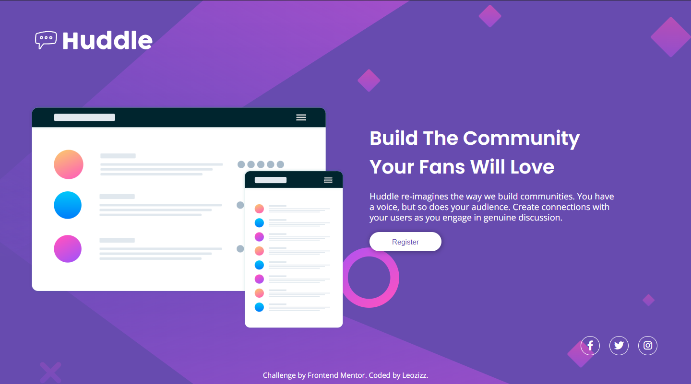

# Frontend Mentor - Huddle landing page with single introductory section solution

This is a solution to the [Huddle landing page with single introductory section challenge on Frontend Mentor](https://www.frontendmentor.io/challenges/huddle-landing-page-with-a-single-introductory-section-B_2Wvxgi0). Frontend Mentor challenges help you improve your coding skills by building realistic projects. 

## Table of contents

- [Overview](#overview)
  - [The challenge](#the-challenge)
  - [Screenshot](#screenshot)
  - [Links](#links)
- [My process](#my-process)
  - [Built with](#built-with)
  - [Continued development](#continued-development)
- [Author](#author)
- [Acknowledgments](#acknowledgments)

## Overview

### The challenge

Users should be able to:

- View the optimal layout for the page depending on their device's screen size
- See hover states for all interactive elements on the page

### Screenshots

### Links

- Solution URL: [Huddle Landing Page - Leozizz GitHub](https://your-solution-url.com)
- Live Site URL: [Huddle Landing Page - Leozizz ](https://your-live-site-url.com)

## My process

### Built with

- HTML5
- CSS custom properties
- Flexbox
- CSS Grid

### Continued development

Currently I don't have in-depth knowledge of HTML and CSS, but I am studying more and more every day and I intend to improve my skills so that I can improve this and other projects in the future.

## Author

- Website - [Leonardo Silva - leozizz](https://leozizz.github.io)
- GitHub - [leozizz](https://github.com/leozizz)
- Frontend Mentor - [@leozizz](https://www.frontendmentor.io/profile/leozizz)

## Acknowledgments

I thank the entire Dev em Dobro team that has been helping me through the DevQuest training where I am having the opportunity to learn and improve my skills in Front-end development and for all the mentoring and help available.